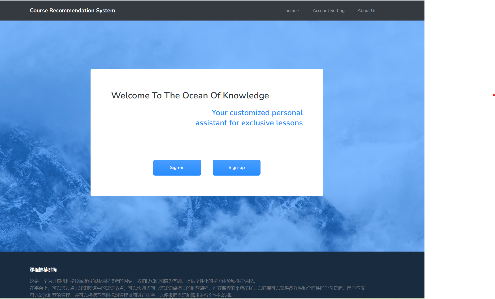
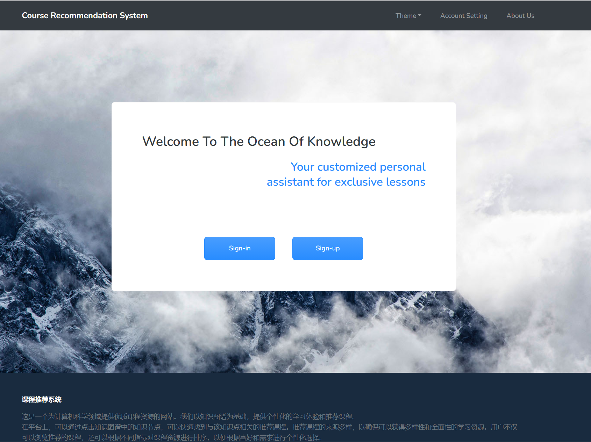
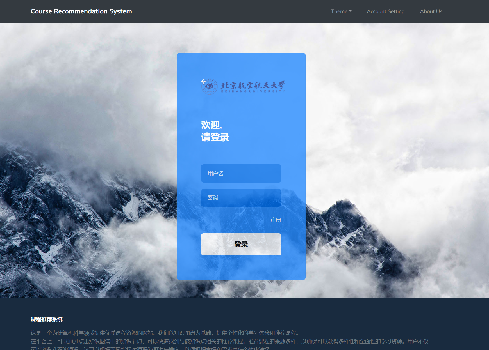
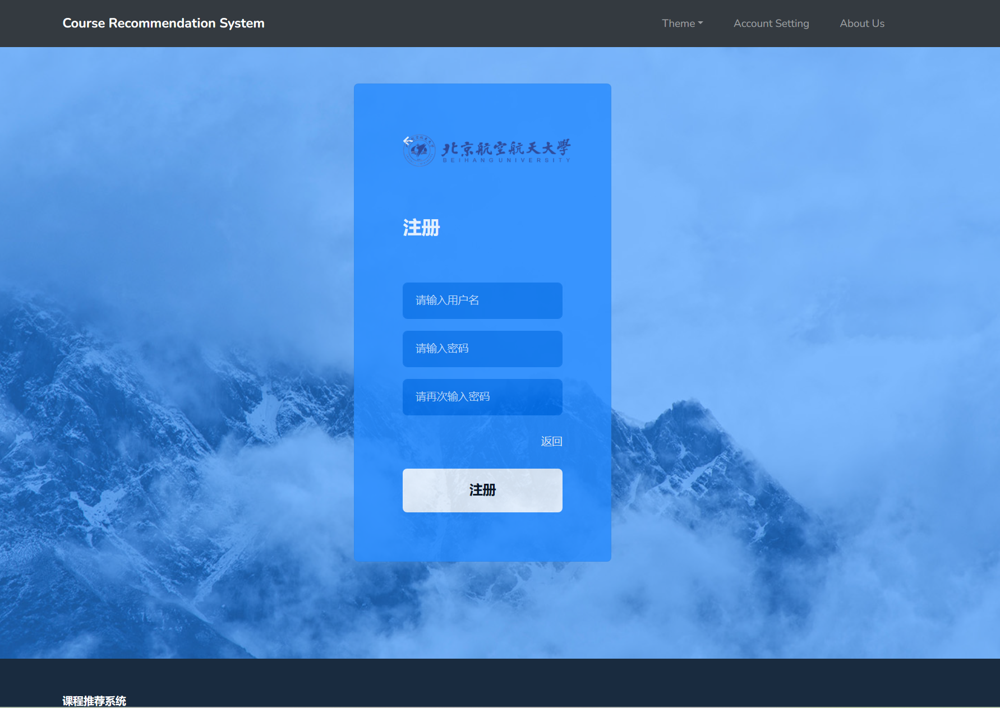
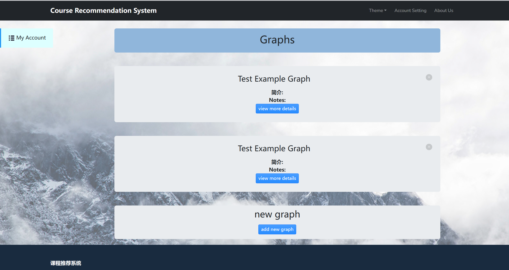
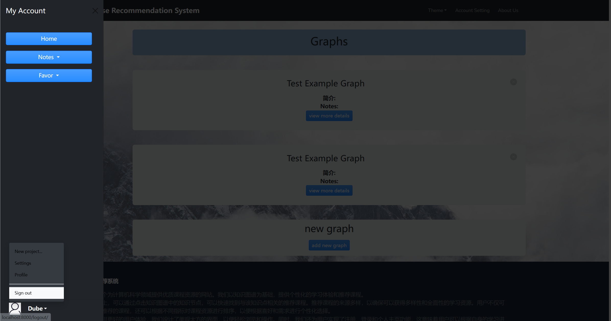
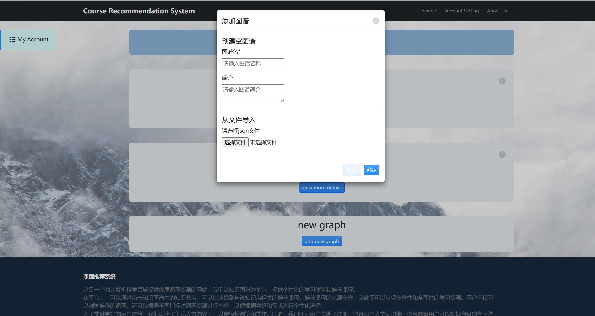
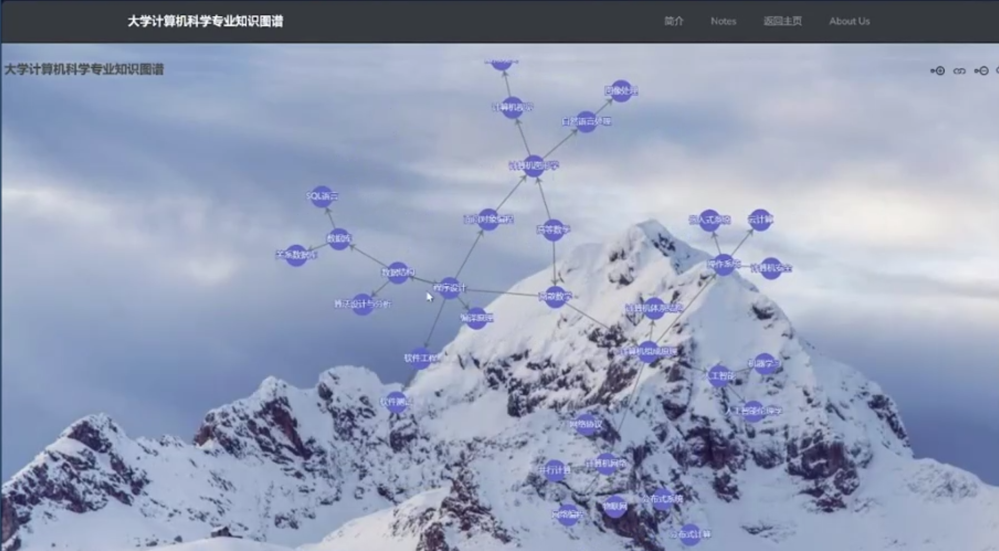
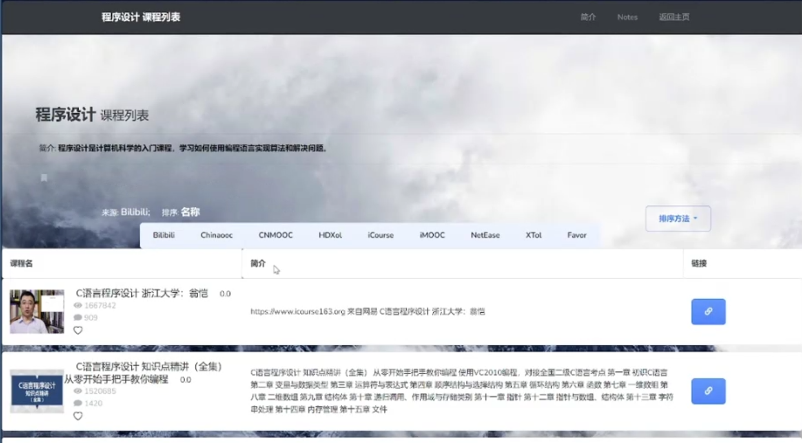

# <center>  大作业项目总结报告


##  <center>  题目：A 


##  <center>  小组成员：


###  <center>  李佳恒（21373169）
###  <center> 雷欣雨（21371119）
###  <center> 王子腾（21373237）
###  <center> 马蔚阳（21373115）


###  <center> 2023年7月


## 一、功能简介

项目拥有的功能如下：

- 用户系统功能
  - 注册、登录
  - 修改头像
  - 个人主页
  - 自定义知识图谱

- 知识图谱
  - 以json定义知识图谱，支持图谱的导出导入  
  - 可视化
  - 创建、链接和修改节点
  - 增加书签
  - 推荐相关课程资源

- 课程网页
  - 分类查看课程详细信息，点击链接跳转网课页面
  - 按需求排序（播放量、评论数、视频发布时间等六个维度）
  - 修改简介
  - 增加书签
  - 收藏课程

## 二、已完成任务

### 必做任务完成情况（4/4）

1. 使用Django完成网页后端开发与前后端交互，使用html/js/css配合bootstrap框架、echarts库进行前端页面设计开发，实现用户系统，用户界面设计简单美观，易于使用。
2. 使用Python网络爬虫工具BeautifulSoup, requests, Selenium获取共八个网站的课程资源。
3. 用户可以对知识图谱进行多个层次的管理和操作：  
   + 节点层次，用户可以创建节点，连接节点并且删除节点，以及对编辑节点自身信息。  
   + 节点的抽象层次，即知识点和课程方面，用户可以根据喜好来收藏课程；并且可以分别在主页和知识点界面查看对应范畴的收藏课程。
   + 图谱层次，用户可以导入.json文件创建知识图谱，或者直接创建空图谱，也可以根据个性化设计的知识图谱导出.json文件。
4. 点击知识图谱的知识节点可以显示对应课程资源，并能够按照一定指标分类和排序。
5. 可以导入neo4j知识图谱并将其可视化，知识图谱资源根据不同用户进行差异化，提供了删除现有知识图谱节点的方法。课程可以根据六个维度的信息进行排序。

### 选做任务完成情况（已完成数量/3）

选做任务自行设计的部分，请标名自定义。

1. 爬取额外三个网站的课程，包括[网易公开课](https://open.163.com/)，[国家高等教育智慧教育平台](https://www.chinaooc.com.cn/)以及[学堂在线](https://www.xuetangx.com/)。
2. 为知识图谱实现 CRUD（创建、读取、更新、删除）操作和书签功能。
3. 完成感兴趣课程的收藏和对应的查看功能（**自定义**）。
4. 完成用户头像及用户名个性化自定义选择并展示的功能（**自定义**）。
5. 完成用户界面主题个性化自定义功能：用户可根据喜好或时间自行选择使用深色主题或者浅色主题（**自定义**）。
6. 完成并完善用户对我们工作的了解渠道：点击页面上面: “About Us”键可以跳转到项目设计团队的介绍栏目（**自定义**）。

## 三、总体设计方案与实现

### 3.1 总体

1.用户系统功能设计：首先是登录、注册页面，每个用户拥有自己的主页。用户可以上传知识图谱，网站对之进行解析并生成Neo4j节点和边，进而通过可视化将其展示。用户点击节点将展示爬取到的网课的列表，并且给出不同的排序方法作为选择。用户可以在图上增加节点和边，增加新节点之后自动爬取相关网课。用户也可以在图谱级别操作，创建、删除图谱等。此外，用户还能对节点和图添加书签、收藏课程等。

2.知识图谱界面中间是可视化的知识图谱。鼠标停留在某个节点或某条边上之后，弹出一个小窗口，列出简略的网课信息。右上角会有三个图标分别为加号，链接符号和减号，分别用以添加节点、将两节点进行链接和删除节点。

3.通过Python网络爬虫工具爬取相应网站的网课资源，相关信息需要包括如网课名、来源、学校、点击量、评分等等。

4.点击可视化图谱的节点可以进入网课信息网页，显示详细信息。可以选择排序方式（名称、评分、播放量、评论数、时长、更新时间），点击网课条目直接跳转到该网课网页。可以切换课程的来源（BiliBili、中国大学MOOC、国家高等教育智慧教育平台、好大学在线、爱课程、慕课网等）。可以对简介进行修改。可以添加书签。


### 3.2 实现效果图
#### 3.2.1 导航主界面
1.呈现简洁美观、用户友好的主引导界面，鼠标放置在sign-in sign-up按钮上会呈现交互式效果。

2.点击导航栏中Theme选项框可以切换主题，从深色主题和浅色主题中随心切换，如下图所示。 

3.点击导航栏中About_us可以自动移动到页面底端，向用户展示本站点的设计目标、引导逻辑和具体功能，用户友好。

#### 3.2.2 登录注册界面
1.登录效果。

2.注册效果，注册成功则跳转至注册成功界面。

#### 3.2.3 用户主界面
1.呈现简洁美观、用户友好的用户主界面，功能分区明确，色调自然；可以查看自己的所有知识图谱。

2.其中左侧功能分区，点击My Account可以进入侧边栏功能栏目，可以通过侧边栏的工具栏方便地切换至需要的界面、汇总性查看自己图谱的tags、查看自己的收藏内容。

3.点击知识图谱右上角能够实现删除功能，点击下方add new graph则可以导入自己的知识图谱文件。

#### 3.2.4 知识图谱界面
1.右上角功能栏可以实现对图节点的添加、连接、删除，以及对整个知识图谱的导出；其中添加节点可以自定义节点名称以及节点简介、节点备注等等。
2.点击知识图谱图标，可以进入该知识图谱对应的课程界面。

#### 3.2.5 课程界面
1.先后选择课程来源网站、排序顺序，等待片刻，即可享用属于自己的私人定制课程推荐清单啦。


### 3.3 核心功能与实现  
#### 3.3.1 数据库  
本站的功能大致分为两个部分：用户部分和Neo4j知识图谱部分。前者使用Django集成的数据库实现(简便期间，直接用python自带的sqlite3)，后者则使用Neo4j数据库，用neomodel通过python远程操控 Neo4j 数据库。  
用继承自Django Auth组件User模型的 UserProfile 模型存储用户信息，相比User，它多了一个存储头像路径的域。此外，每个用户有各自的UserGraphs, UserTags, UserFavorites三个表与之关联，意义分别是用户所拥有的图、用户的书签（或notes，虽然tag是标签意，但这里我们用作书签或notes）、用户收藏的课程。  

每个图由一个根节点GraphRoot和若干互相连接的知识节点构成，每个知识节点连接着它爬取来的课程。保证根节点和知识图谱中所有弱连通分支的至少有一个节点链接，保证知识图谱中的所有节点从根出发(在基础图上)可达。课程节点中存储课程相关的信息，如网址、封面、简介、播放量、观看人数、评分等。  

  

#### 3.3.2 知识图谱的可视化  
知识图谱使用echarts拓扑图进行可视化，echarts所需的所有节点数据、边数据都在后端自动生成为字符串，由Django“渲染”到前端html文本中传给浏览器。echarts配置如下：  
```
var option = {
   // 图的标题
   title: {
       text: '{{graph.graph_name}}'  //改成当前知识图谱的名称.
   },
   // 提示框的配置
   tooltip: {
       trigger:'item',
       formatter: function (x) {
           const node = x.data;
           if(typeof(node.name)=="undefined"){
               // 一定是边.
               return `${node.source} --> ${node.target}`;
           }
           return `<h5>${node.name}</h5><hr>介绍：${node.intro}<hr>note: ${node.tag}`;
       }
   },
   // 工具箱
   toolbox: {
       // 显示工具箱
       show: true,
       itemSize: 20,
       itemGap: 12,
       feature: {
           // TODO: 寻找设置图标.
           myToolAdd:{
               show:true,
               title:'添加节点',
               icon:"image:///static/icons/node-plus.svg",
               onclick: addNodeCallback,
           },
           myToolLink:{
               show:true,
               title:'连接节点',
               icon: "image:///static/icons/link.svg",
               onclick: linkNodeCallback,
           },
           myToolDelete:{
               show:true,
               title:'删除节点',
               icon: "image:///static/icons/node-minus.svg",
               onclick: deleteNodeCallback,
           },
           myToolExport:{
               show:true,
               title:'导出',
               icon:"image:///static/icons/cloud-download.svg", //记得改回相对路径.
               onclick: downloadCallback,
           },
       }
   },
   series: [{
       type: 'graph', // 类型:关系图
       layout: 'force', //图的布局，类型为力导图
       symbolSize: 50, // 调整节点的大小
       roam: true, // 是否开启鼠标缩放和平移漫游。默认不开启。如果只想要开启缩放或者平移,可以设置成 'scale' 或者 'move'。设置成 true 为都开启
       edgeSymbol: ['circle', 'arrow'],
       edgeSymbolSize: [2, 10],
       force: {
           repulsion: 2500,
           edgeLength: [15, 100]
       },
       draggable: true,
       lineStyle: {
           normal: {
               width: 2,
               color: '#4b565b',
           }
       },
       label: {
           formatter:'{b}',
           normal: {
               show: true,
               textStyle: {}
           }
       },

       // 数据
       data: node_datas,
       links: edge_datas,
   }]
};
```  
其中 node_datas 和 edge_datas 的值由后端直接生成为字符串传入，将会动态地填充到这两个变量中。  
```
node_datas_str, edge_datas_str = graph.get_str()
ctx = {
   "graph":graph_root,
   "node_datas":node_datas_str,
   "edge_datas":edge_datas_str,
}
return render(request, "Neo4j/kgbase.html", ctx)
```
```
def get_str(self):
  '''
  获得echarts所需格式的两个字符串,返回
  node_datas, edge_datas.
  '''
  node_datas = "[\n"
  edge_datas = "[\n"
  for know in self.knowledges:
      node_str = \
      '''
      {{
          name:"{}",
          uid:"{}",
          intro:"{}",
          tag:"{}"
      }},\n
      '''.format(str(know.name).strip(), str(know.uid).strip(), str(know.introduction).strip(), str(know.tag).strip())
      node_datas += node_str
      for rel_node in know.rel_knowledge.all():
          edge_str = \
          '''
          {{
              source:"{}",
              target:"{}"
          }},\n
          '''.format(str(know.name).strip(), str(rel_node.name).strip())
          edge_datas += edge_str
  
  node_datas += "]"
  edge_datas += "]"
  return node_datas, edge_datas
```

#### 3.3.3 知识图谱操作  
知识图谱操作包括增添/删除整个知识图谱、导出知识图谱为.json、导入json格式的知识图谱、增添/删除单个节点，以及将两个节点互相连接。相关处理都在 Neo4j/graph.py下的Graph类中，前端使用 ajax 向后端发起请求。  
其中，.json知识图谱格式的具体定义见 static/graphs/schema.json.  

以下为核心代码示例，详见 Neo4j/graph.py 和 Neo4j/node_operation.py
+ 为单个节点爬取课程  
  ```
  def crawlCoursesForKnowledge(knowledge:KnowledgeBlock, src:str = None):
    '''
    给knowledge节点爬取课程并且保存到数据库. 这里不做任何检查.
    '''
    courses = crawl_courses(knowledge.name, src)
    if src is None:
        srcarray = SourceList
    else:
        srcarray = [src]
    for src in srcarray:
        cList = courses[src]
        for course in cList:
            if course[INDEX.introduction] == "0":
                course[INDEX.introduction] = "暂无简介"
            node = Course(name = course[INDEX.name], web = course[INDEX.web], source = src, 
                          cover = course[INDEX.cover], introduction = course[INDEX.introduction],
                          comments_num = course[INDEX.comments_num], duration = course[INDEX.duration], 
                          score = course[INDEX.score], time_start = course[INDEX.time_start], viewer_num = course[INDEX.viewer_num])
            node.save()
            knowledge.rel_courses.connect(node)
  ```
  其中，crawl_courses是爬取器。  
+ 节点的创建
  ```
  def create_node(self, name:str, introduction:str, crawl:bool = False):
    for know in self.knowledges:
        if know.name == name:
            return know   # 有重名的就不创建新的了.
    newknow = KnowledgeBlock(name = name, introduction = introduction).save()
    self.root.rel_knowledge.connect(newknow)
    self.knowledges += [newknow]
    if crawl:  # 需要爬取.
        Graph.crawlCoursesForKnowledge(newknow)
    return newknow
  ```
+ 节点的删除  
  ```
  def delete_node(self, knowledge:KnowledgeBlock, validate:bool=True):
        '''
        删除这个节点以及所有相关的课程.
        这里不做检查了..
        返回被删除的节点原本的uid.
        '''
        # 检验确实有这个节点.
        if validate:
            valid = False
            for know in self.knowledges:
                if know.uid == knowledge.uid:
                    valid = True
                    break
            if not valid:
                raise "KnowledgeBlock does not exist in this graph"
        # 从graph当前节点中删除.
        ind = self.knowledges.index(knowledge)
        self.knowledges.pop(ind)
        # 删除所有相关课程.
        for course in knowledge.rel_courses.all():
            
            #ourse.delete()
            deleteTagNode(self.user, course)
        # 把与这个knowledge相关的所有节点和root相连.防止删除之后不再连通.
        for rel_know in find_all_knowledge_from_knowledge(knowledge):
            self.root.rel_knowledge.connect(rel_know)
        uid = knowledge.uid
        # knowledge.delete()
        deleteTagNode(self.user, knowledge)
        return uid
  ```
  它保证根节点到任意节点的可达性不因删除这个节点而失效。具体而言，就是把和要删除节点相连的所有节点直接和根节点相连。  

+ 图的导入导出  
  ```
  def export_json(self, save_to_file:bool=True, get_tag:bool = False):
        '''
        将该图导出为json文件.保存到固定目录，文件名为graph的uid.json  
        如果save_to_file为false，就只返回字典.如果是True, 返回导出的json文件路径.
        '''
        knows_dicts = []
        edges_dicts = []
        courses_dicts = []
        knows = find_all_knowledge_in_graph(self.root)
        for i in range(len(knows)):
            knows_dicts.append({
                "name":str(knows[i].name),
                "tag":str(knows[i].tag) if get_tag else "",
                "introduction":str(knows[i].introduction),
            })
            for relknow in knows[i].rel_knowledge.all():
                rel = knows[i].rel_knowledge.relationship(relknow)
                edges_dicts.append({
                    "from":i,
                    "to":knows.index(relknow),
                    "tag":str(rel.tag) if get_tag else "",
                })
            for course in find_all_courses_in_knowledge(knows[i]):
                courses_dicts.append({
                    "knowledge":i,
                    "tag":str(course.tag) if get_tag else "",
                    "name" : str(course.name),
                    "web" : str(course.web),
                    "source" : str(course.source),
                    "duration" : str(course.duration),
                    "viewer_num" : str(course.viewer_num),
                    "introduction" : str(course.introduction),
                    "cover" : str(course.cover),
                    "comments_num" : str(course.comments_num),
                    "time_start" : str(course.time_start),
                    "score" : str(course.score),
                })
        
        ret = {
            "name":str(self.root.graph_name),
            "introduction":str(self.root.introduction),
            "tag":str(self.root.tag) if get_tag else "",
            "knowledges":knows_dicts,
            "edges":edges_dicts,
            "courses":courses_dicts,
        }
        if not save_to_file:
            return ret
        else:
            p = join(settings.GRAPH_JSON_DIR, "{}.json".format(self.root.uid))
            with open(join(p,'w')) as f:
                json.dump(ret, f, ensure_ascii=False)
            return p
  ```

### 3.3.4 网络爬虫
**(在此补充爬虫的核心代码与实现)**

（在此补充功能的具体设计描述、核心代码和实现图）

## 四、项目运行过程

1. 克隆仓库
   - `git clone https://gitee.com/Jiaheng-Li/course-recom.git`
2. 安装Python依赖库
   - `pip install -r requirements.txt` 注意依赖中存在模块bilibili_api要求python版本3.7~3.9
3. 安装Neo4j数据库
   - Neo4j官网下载桌面版desktop。
   - 运行neo4j，访问 localhost:7474，能打开说明成功。
   - 初次打开默认用户名密码都是neo4j，之后会要求修改。
   - 新建一个叫 course-recom 的数据库。
   - 保持neo4j在后台运行。
4. Django项目
   - git clone从gitee仓库拉取项目
   - 新建一个course-recom/developer_sign.txt，第一行为自己neo4j的用户名，第二行为密码。
   - 在course-recom的文件夹处，打开命令行，运行 python manage.py migrate，创建用户数据库。
   - 使用命令：$ neomodel_install_labels Neo4j.py Neo4j.models --db bolt://用户名:密码@localhost:7687/course-recom在neo4j数据库中创建节点和边的定义，注意用户名和密码改成个人注册所填的。
   - 运行python manage.py runserver 0.0.0.0:8000，在本地打开我们的网页的服务器
   - 访问 localhost:8000/login进入登录页面。
5. 按照具体的操作步骤进行项目的运行，比如：
   - 进入用户系统，注册或登录账号。
   - 点击知识图谱中的节点，查看推荐的相关课程资源。
   - 根据需求查看其他功能，如删除知识图谱节点、添加书签等。

## 五、项目总结

- 项目整体完成情况符合预期，我们成功地实现了一个基于知识图谱的课程资源推荐平台。用户系统的设计增强了自定义图谱的功能，可以导入知识图谱并将其可视化，并且爬取了多个课程平台的资源以及多维课程数据，使得平台具有更高的信息价值。通过项目中的网站交互设计使平台操作简便，用户友好度较高。

## 六、课程学习总结

1. **课程收获和难点分析**
   - 在本次大作业前，我们小组成员对Python的基础有一定了解，但几乎没有项目相关的数据库、网页界面以及爬虫方面的具体知识。通过此次项目，我们掌握了通过git进行项目合作，构建Neo4j知识图谱并可视化，使用网络爬虫工具获取数据，使用Django开发简单网站并将各部分数据相关联,进而对Python的应用有了更深刻的理解。其中，最困难的地方在于网站界面的开发设计和爬虫多种情况数据的处理。
2. **教师授课评价**
   - 李老师的授课表述清晰生动，课程内容安排合理，示例和实践帮助我们更好地理解知识点。希望老师在未来的课程中能够介绍一些数据处理分析的方法，以及一个多文件层级项目的配置运行方法。
3. **助教评价**
   - 助教在课程中提供了很好的答疑帮助，在题目有疑议时也能够及时解决。
4. **当前课程教授内容评价与课程进一步改进建议**
   - 当前课程教授的内容基础、全面，但有一些基础部分时间分配略多。建议将某些难度较高的内容如数据结构和面向对象细化，分配更多课程时间，并增加一些实践作业，帮助学生更好地掌握知识。

## 七、主要参考资料

- Neo4j模块
  - Neo4j 文档: https://neo4j.com/docs/cypher-manual/5
  - neomodel 文档：https://neomodel.readthedocs.io/en/latest/
  - Echarts 文档：https://echarts.apache.org/zh/
- User模块
  - Django文档: https://docs.djangoproject.com/zh-hans/4.2/
  - Bootstrap 文档：https://v5.bootcss.com/docs/getting-started/introduction/
  - UI元素包 boomerang 文档：https://www.bootmb.com/themes/boomerang/
  - Django 菜鸟教程: https://www.runoob.com/django/
- 爬虫模块
  - Beautiful Soup 文档: https://beautifulsoup.cn/
  - Selenium 文档: https://www.selenium.dev/zh-cn/documentation/
  - Python requests 模块 | 菜鸟教程: https://www.runoob.com/python3/python-requests.html
  - bilibili-api · PyPI: https://pypi.org/project/bilibili-api/
- 前端模块
  - Boomerang 素材：https://www.bootmb.com/themes/boomerang/
  - Bootstrapv3 素材：https://v3.bootcss.com/components/
  - CSS 菜鸟教程：https://www.runoob.com/css/css-tutorial.html
  - HTML 菜鸟教程：https://www.runoob.com/tags/html-reference.html
  - JavaScript 菜鸟教程：https://www.runoob.com/js/js-tutorial.html

## 八、项目功能实际展示视频（不超过5min）

请录制关于产品运行后在一中提到的相关功能演示。